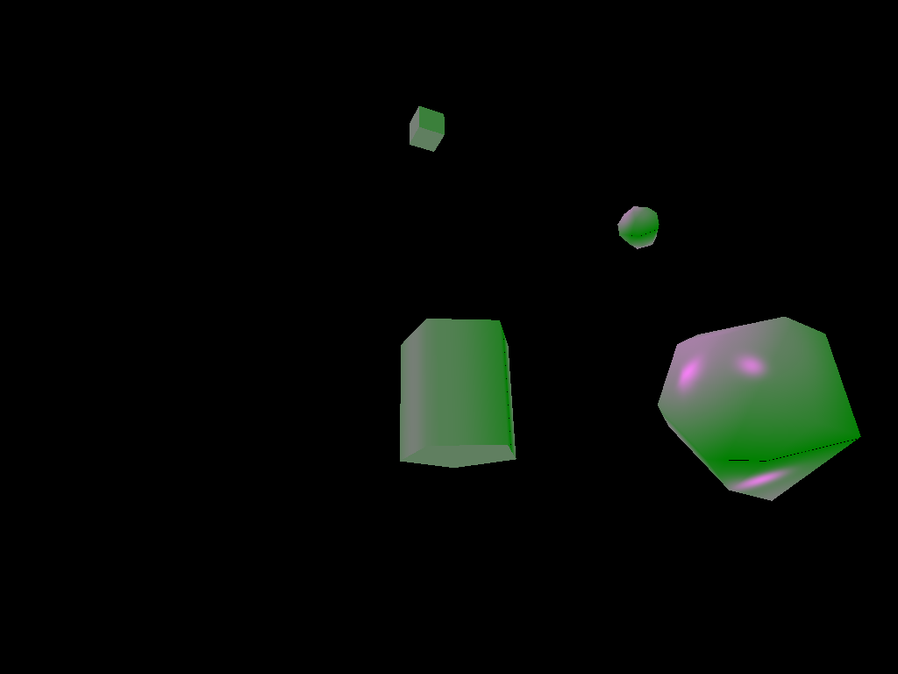
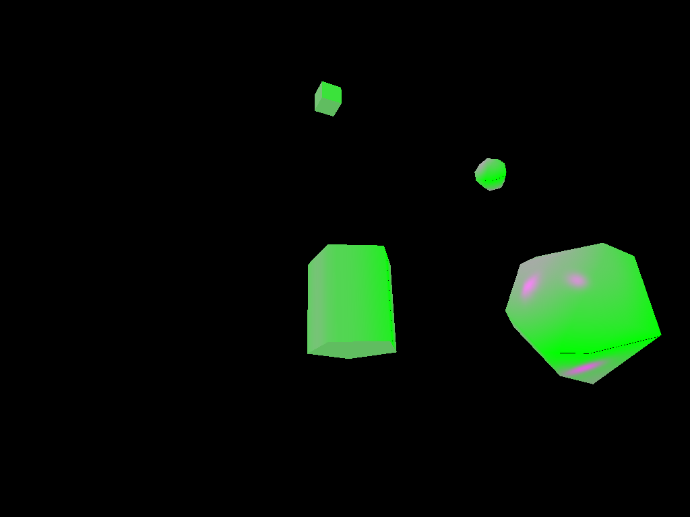
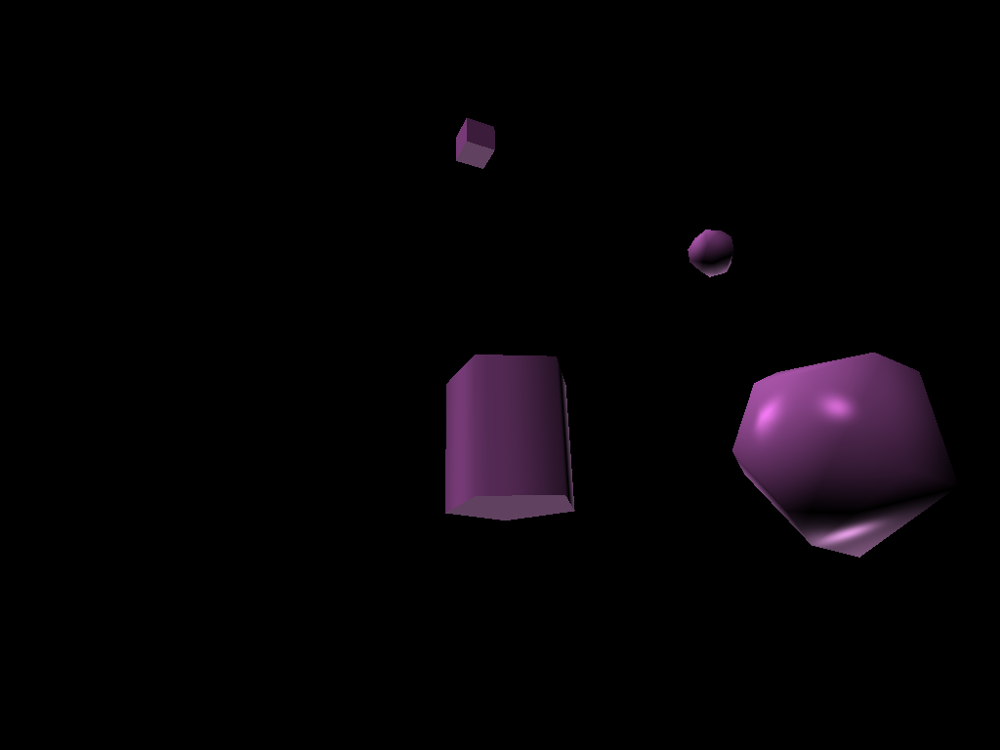
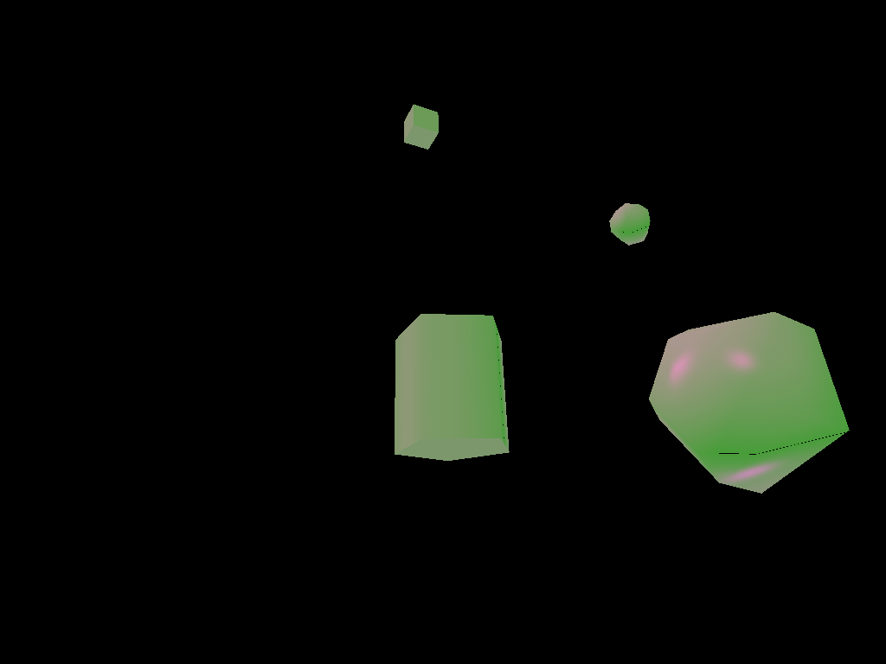
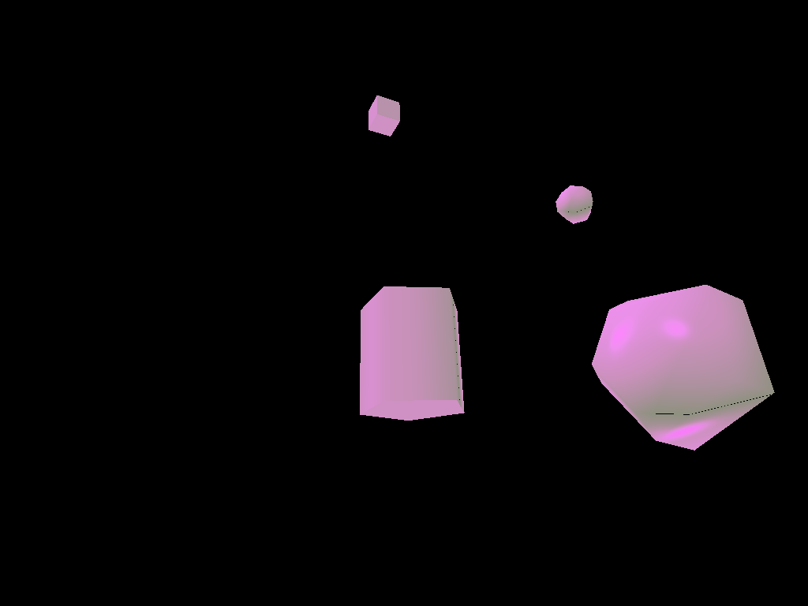
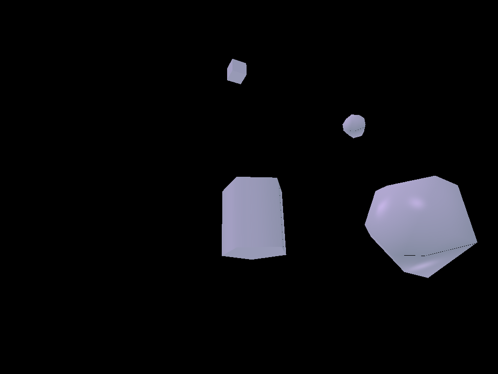
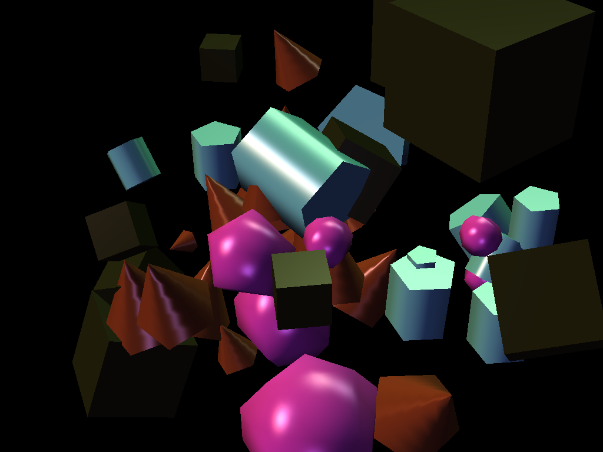
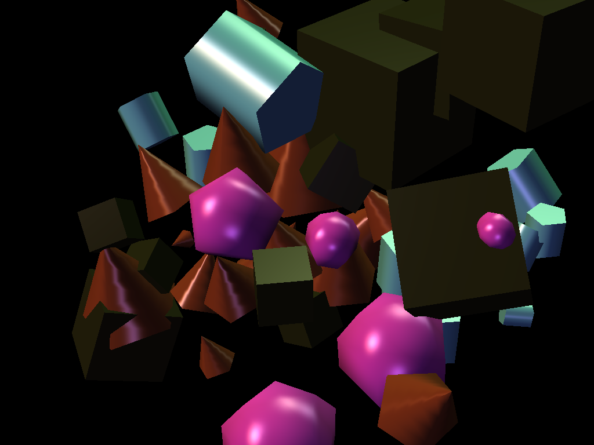
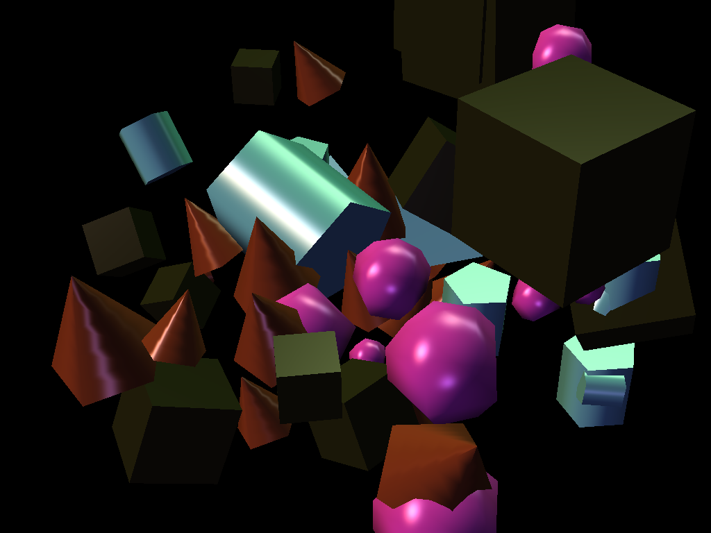

# Project 6: Final Project Gear Up

The project handout can be found [here](https://cs1230.graphics/projects/final/gear-up).

## Test Cases
### Post-processing & Color Grading
**Test A - Grade Strength Sweep**

Demonstrates that `u_GradeStrength` smoothly interpolates between the original scene `parse_matrix.json` and the LUT-graded result using `identity_lut_4x4.png` with colorGrading enabled. 

| Settings | Output |
|----------------|--------|
| Strength = 0.0 |  |
| Strength = 0.5 |  |
| Strength = 1.0 |  |

---

**Test B — Toggle Color Grading**

Verifies that `u_EnableColorGrading` correctly bypasses the effect.

| Settings | Output |
|----------|--------|
| EnableColorGrading = false |  |
| EnableColorGrading = true, strength = 1.0 |  |

---

**Test C — Multiple LUTs**

Shows that the LUT pipeline is general and works with any valid LUT texture with `u_GradedStrength = 0.8`.

| LUT | Output |
|--------|--------|
| Teal/Orange |  |
| Purple/Blue |  |
| B&W Contrast |  |

---

### Instance Rendering

**Test D - Standard instance rendering outputs**

This test case demonstrates that instance rendering applies the per-instance `mat4` transformations loaded from `primitive_salad_1.json`, with a one-time random jitter applied to position and scale for visual variation. Randomization is applied when we first load the scene. To show that each primitive's size and location is randomized for every scene load, I generated three separate variations. 

| Description | Output |
|--------|--------|
| Variation 1 |  |
| Variation 2 |  |
| Variation 3 |  |

**Test E - Edge cases for instance rendering**

| Description | Output |
|--------|--------|
| Single-instance edge case |  |

Scenes with one primitive type still uses `glDrawArrayInstanced(..., instanceCount = 1)` instead of a separate non-instanced path and works perfectly. 

---

## Design Choices
### Post-processing pipeline + color grading
To implement color grading, I improved the overall architecture by moving all post-processing methods to a dedicated `PostProcess` class. Now `Realtime` is only be responsible for the high-level orchestration of rendering the scene geometry into an off-screen buffer and triggering the final compositing pass. `PostProcess` creates the off-screen FBO, compiles the post-processing shader, loads the LUT, and calls the final full-screen render pass. 

Color grading is implemented using a clean two-pass design. Pass 1 is **scene rendering** where the full 3D sceen is rendered into the FBO texture, which is then used for pass 2's **post processing**. In the second pass, we use `texture.frag` to draw a screen-aligned quad. The shader: 
1. Samples the scene from `tOrig`
2. Sampesl the LUT texture from `tLUT`
3. Performs tri-linear lookup into the LUT
4. Blends the graded and ungraded colors based on `u_GradeStrength`
5. Supports toggling the effect using `u_EnableColorGrading`

### Instance rendering
To efficiently draw a large number of primitives, I extended the real-time renderer to support **instanced rendering**. This allows copies of the same geometry to be drawn with a single draw call by supplying transformation data to the GPU for each instance instead of every single primitive, significantly reducing the CPU overhead. 

Before applying instance rendering, each shape in the scene triggered its own draw call: 
```
for each shape:
  glBindVertexArray(...)
  glUniformMatrix4fv(model)
  glDrawAray(...)
```

Now, instancing replaces this with one draw call for each primitive type. This makes rendering cost independent of the number of shapes and only dependent on the number of primitive types. 
```
glDrawArrayInstanced(..., instanceCount)
```

## Collaboration/References
I used ChatGPT to generate different LUT png files to test that my post processing pipeline works for multiple LUT files and how multiple color grading effects creates different image outputs. I also used it to help organize this submission md file to follow the previous submission file template and generate test cases that fully demonstrates the functions I implemented. 

## Known Bugs
N/A
